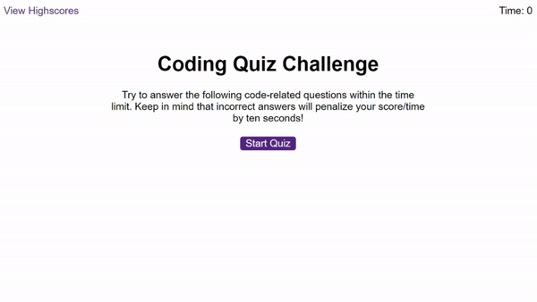

# Web-API-Coding-Quiz
A coding quiz featuring Web APIs

In this project, I created a code quiz demonstrating the use of Web APIs. I also utilised functions, objects and conversion methods. In this coding quiz, the timer is the score and the player can only progress in the quiz  by answering questions correctly, which adds time to the timer. If questions are answered incorrectly, the timer runs out and the quiz is over. Highscores are logged into a highscores ranking, which retrieves the scores from local storage. 

This was a complex project that I chose to break up into parts, the first being creating an object to store the questions and answers. When the start button is clicked, the questions screen appears and a for loop cycles through the questions. If the end is reached, the end screen appears and the player can submit their initials. Their high score is then logged.

Some challenges included finding a way to sort an array with both string and number values, and correctly converting the local storage to a usable object, for which I used the JSON.parse method. Overall I am happy with the results.

DEPLOY LINK
https://xanlefee.github.io/Web-API-Coding-Quiz

## Installation

Load the repo in google chrome.

## Usage 

Once loaded in google chrome, play the quiz accordingly.

## Credits

Starter content provided by Edex.

## License
MIT License

Copyright (c) 2023 Xanthe E. Horner

Permission is hereby granted, free of charge, to any person obtaining a copy
of this software and associated documentation files (the "Software"), to deal
in the Software without restriction, including without limitation the rights
to use, copy, modify, merge, publish, distribute, sublicense, and/or sell
copies of the Software, and to permit persons to whom the Software is
furnished to do so, subject to the following conditions:

The above copyright notice and this permission notice shall be included in all
copies or substantial portions of the Software.

THE SOFTWARE IS PROVIDED "AS IS", WITHOUT WARRANTY OF ANY KIND, EXPRESS OR
IMPLIED, INCLUDING BUT NOT LIMITED TO THE WARRANTIES OF MERCHANTABILITY,
FITNESS FOR A PARTICULAR PURPOSE AND NONINFRINGEMENT. IN NO EVENT SHALL THE
AUTHORS OR COPYRIGHT HOLDERS BE LIABLE FOR ANY CLAIM, DAMAGES OR OTHER
LIABILITY, WHETHER IN AN ACTION OF CONTRACT, TORT OR OTHERWISE, ARISING FROM,
OUT OF OR IN CONNECTION WITH THE SOFTWARE OR THE USE OR OTHER DEALINGS IN THE
SOFTWARE.

